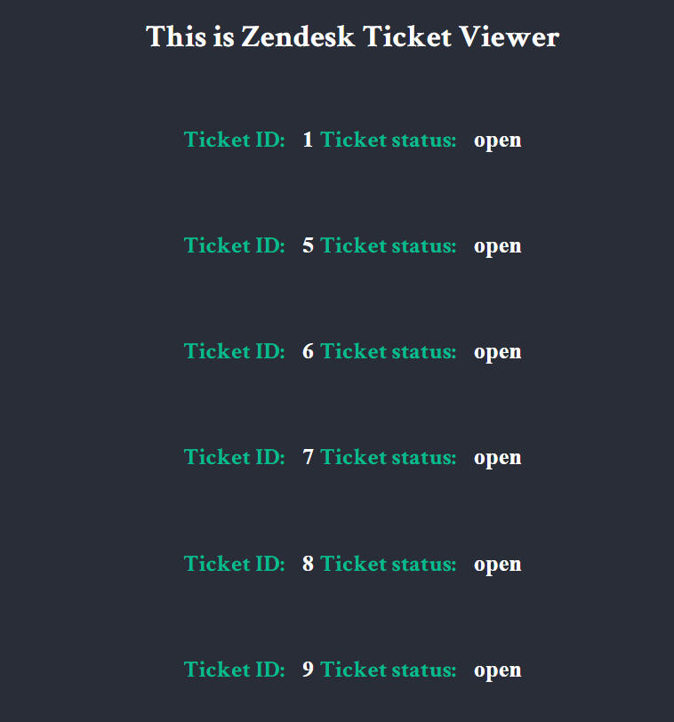

# Zendesk Ticket Viewer #

## Description
Zendesk ticket viewer is an application that queries [Zendesk](https://www.zendesk.com/ "Zendesk") rest API to retrieve tickets for a certain account. The project is build as a part of Zendesk recruitment coding challenge.

## Features

           
The application displays 25 tickets per page, switches between next and previous pages and displays individual ticket details. Please note that at the moment first page shows last ticket with id 28, because 3 tickets have been deleted.

           
This project is my first attempt to call and communicate with rest API to source data. I chose to use node-fetch for it. I got to this decision through the process of trial and error while trying out other options.

           
Pagination is cursor-based.

           
Individual ticket details are displayed by jQuery. I realize that today jQuery is not so popular and necessary as it used to be, but it has allowed me to keep my code lightweight and laconic. 

           
The UI is aimed to be simple and usable.

## Technologies
* Nodejs
* jQuery
* HTML
* CSS

## Dependancies
* Expressjs
* EJS
* Express-EJS-Layouts
* Dotenv
* node-fetch

## Installation

Download or clone the repo and run the following in the same folder.

`npm install`

Authorization credentials are stored in .env file which usually should be gitignored in order not to compromise them. To help Zendesk recruitment team to check the project .env file will be pushed to the repo. 

## Application preview

Pagination:

404 error handling:

Pagination

## Author
Iulia (Julia) Sharnina - iusharnina@gmail.com
