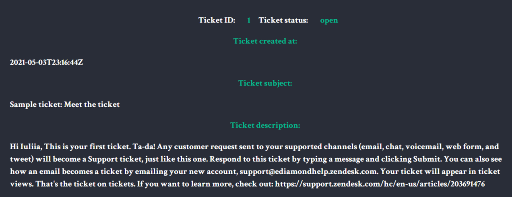

# Zendesk Ticket Viewer #

## Description
Zendesk ticket viewer is an application that queries [Zendesk](https://www.zendesk.com/ "Zendesk") rest API to retrieve tickets for a certain account. The project is build as a part of Zendesk recruitment coding challenge. Made by Iulia (Julia) Sharnina.

## Features

           
The application displays 25 tickets per page, switches between next and previous pages and displays individual ticket details. Please note that at the moment first page shows last ticket with id 28, because 3 tickets have been deleted.
                      

           
This project is my first attempt to call and communicate with rest API to source data. Although I have done node projects before, and this task seemed faily simple in the begining it took me a while to find proper tools to perform it. After a process of trial and error I chose to use node-fetch for communication with Zendesk API. 
                      

           
Pagination is cursor-based.

           
Individual ticket details are displayed by jQuery. I realize that today jQuery is not so popular and necessary as it used to be, but it has allowed me to keep my code lightweight and laconic. 

           
The UI is kept simple and usable.

## Technologies
* Nodejs
* jQuery
* HTML
* CSS
* Expressjs
* EJS
* node-fetch

## Installation

Download or clone the repo and run the following in the same folder.

`npm install`

The project runs on localhost:3007

Authorization credentials are stored in .env file which usually should be gitignored in order not to compromise them. Since this project is subbmitted for a review, .env file is made public to help Zendesk recruitment team to check the project. 

## Application preview

Pagination:

404 error handling:

Pagination

## Tests

Unit tests are written with Mocha & Chai. There are 5 tests. To run tests type in the command line:

`npm test`

           
Unit tests cover business logic which in the case of this application is getTicketsZendeskUrl function. While getTickets funtion encupsulates all logic of pagination. The get home page route and getTickets funtion are pretty simple and do not cantain business logic. Pagination is is cursor based and is implemented on Zendesk server, therefore doesn't need testing.

           
This is the first time I have written unit tests. I have genuinly enjoyed the process of learning how to do it, while I realize that this part requires more research, which will be my target for the the next couple of weeks. 

## Author
Iulia (Julia) Sharnina - iusharnina@gmail.com
