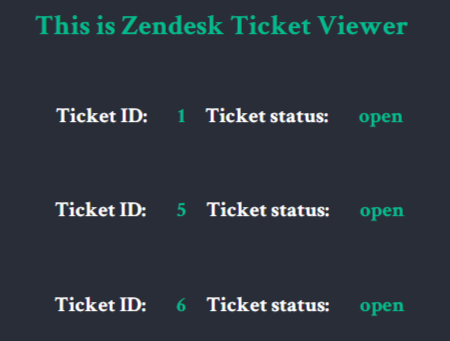
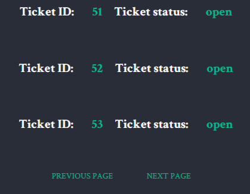

# Zendesk Ticket Viewer #

## Description
Zendesk ticket viewer is an application that queries [Zendesk](https://www.zendesk.com/ "Zendesk") rest API to retrieve tickets for a certain account. The project is build as a part of Zendesk recruitment coding challenge. Made by Iulia (Julia) Sharnina.

## Features

           
The application displays 25 tickets per page, switches between next and previous pages, and displays individual ticket details. Please note that at the moment the first page shows the last ticket with id 28, because 3 tickets have been deleted.
                      

           
This project is my first attempt to call and communicate with the rest API from the back-end. Although, I have done node projects before, and this task seemed fairly simple in the beginning it took me a while to find proper tools to perform it. After a process of trial and error, I chose to use node-fetch for communication with Zendesk API.  
                      

           
Pagination is cursor-based.

           
Individual ticket details are displayed by jQuery. I realize that today jQuery is not so popular and necessary as it used to be, but it has allowed me to keep my code lightweight and laconic.  

           
The UI is kept simple and usable.

## Technologies
* Nodejs
* jQuery
* HTML
* CSS
* Expressjs
* EJS
* node-fetch

## Installation

Download or clone the repo and run the following in the same folder.

`npm install`

The project runs on localhost:3007

Authorization credentials are stored in .env file which usually should be gitignored in order not to compromise them. Since this project is submitted for review, the .env file is made public to help the Zendesk recruitment team to check it.  

## Application preview

Pagination:

404 error handling:

Pagination

## Tests

Unit tests are written with Mocha & Chai. There are 5 tests. To run tests type in the command line:

`npm test`

           
Unit tests cover business logic which in the case of this application is the getTicketsZendeskUrl function. While the getTickets function encapsulates all logic of pagination. The get home page route and the getTickets function are pretty simple and do not contain business logic. Pagination is cursor-based and is implemented on the Zendesk server, therefore doesn't need testing.

           
This is the first time I have written unit tests. I have genuinely enjoyed the process of learning how to do it, while I realize that this part requires more research, which will be my target for the next couple of weeks. 

## Author
Iulia (Julia) Sharnina - iusharnina@gmail.com
